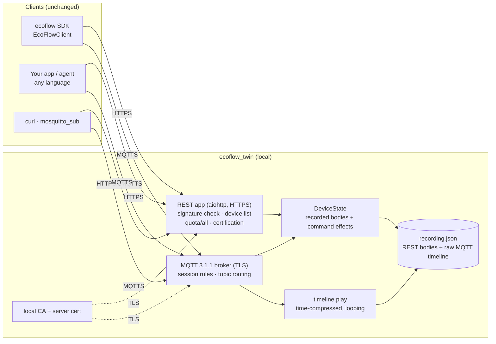
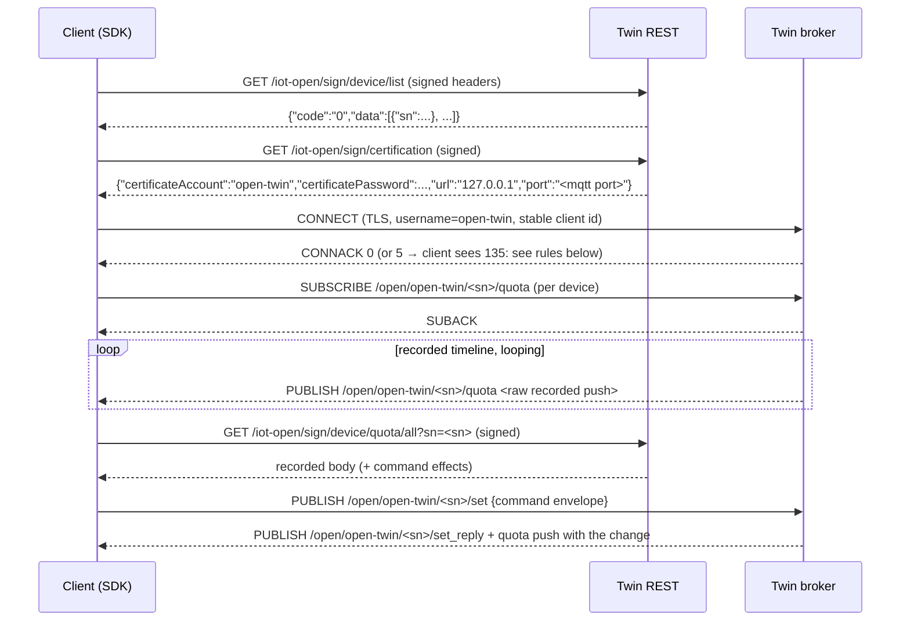

# EcoFlow service digital twin

`ecoflow_twin` is a local **behavioural clone of EcoFlow's Developer API**: real
HTTPS REST and a real MQTT 3.1.1 broker over TLS, answering from recordings of
real devices. Your app, an AI agent, or CI connects over the same protocols it
would use against `api-e.ecoflow.com` and `mqtt-e.ecoflow.com`. It needs no
credentials, has no rate limits, doesn't compete with Home Assistant for the
account's single MQTT session, and never touches real hardware.

This follows the *Digital Twin Universe* idea (StrongDM's clones of the
third-party services their software depends on, and Microsoft Amplifier's DTU
mock services): test at the network boundary, from the real client's point of
view, with the service's observed behaviour — including its refusals.

```bash
pip install "ecoflow-python[twin]"          # or: uv sync --all-extras
ecoflow-twin serve --recording tests/recordings/live-20260928/recording.json
```

The command prints **one line of JSON**, which scripts and agents can parse:

```json
{"rest_base": "https://127.0.0.1:60321", "mqtt_host": "127.0.0.1", "mqtt_port": 60322,
 "ca_file": ".ecoflow-twin/ca.pem", "access_key": "twin-access-key",
 "secret_key": "twin-secret-key", "account": "open-twin",
 "account_password": "twin-mqtt-password",
 "env": {"ECOFLOW_REST_BASE": "https://127.0.0.1:60321",
         "ECOFLOW_CA_FILE": ".ecoflow-twin/ca.pem",
         "ECOFLOW_ACCESS_KEY": "twin-access-key",
         "ECOFLOW_SECRET_KEY": "twin-secret-key"}}
```

Options: `--rest-port`/`--mqtt-port` (0 means any free port), `--speed`
(1 = real time), `--state-dir` (where the CA and keys live, reused across
restarts), `--host`, and `--client-id-limit`.

## Architecture



The SDK needs no twin-specific code. The **only** SDK addition is `Endpoints`:
`ECOFLOW_REST_BASE` replaces the region's REST host and `ECOFLOW_CA_FILE` adds
a trusted CA. The MQTT broker address always comes from the `certification`
response, just as with EcoFlow, so pointing REST at the twin is enough.

The SDK logs a **warning** for each one that is set:
`ECOFLOW_REST_BASE` redirects every REST request, including the access-key
header, to that host; `ECOFLOW_CA_FILE` only changes which CA is trusted for
TLS (requests still go to the configured host). `rest_base` must be `https://`
with a host and a valid port, and must not contain credentials, a query or a
fragment. Pass `endpoints=` explicitly in code when you want no
environment involvement at all.

**Keep the twin CA local.** The twin's server certificate is valid for
EcoFlow's real host names (`api-e.ecoflow.com`, `mqtt-e.ecoflow.com`, …) so apps
can be pointed at it. Trust `ca.pem` only per process (`ECOFLOW_CA_FILE`,
`curl --cacert`); never add it to a system or browser trust store, or anyone
who can read `server.key` could impersonate EcoFlow on that machine. The twin
writes `server.key` owner-only (`0600`) and refuses a symlinked or foreign-owned
key. The CA's own private key is never saved, so no further certificates can be
issued from it. On **Windows** there are no POSIX modes: the key gets the ACLs
of its folder. The default `--state-dir` is `.ecoflow-twin` in the current
directory, so run the twin from a folder inside your user profile.

## Connection flow

This is the same sequence the SDK runs against EcoFlow, with every step
answered by the twin:



## Protocols, as the twin implements them

### REST signature

EcoFlow's Developer API signs every request. The signature is:

```
canonical = "<sorted k=v request params, '&'-joined>&accessKey=<ak>&nonce=<n>&timestamp=<ms>"
sign      = hex(HMAC-SHA256(secret_key, canonical))
headers   : accessKey, nonce, timestamp, sign
```

- **The params:** for a `GET`, the query string. For a JSON-body request, the
  flattened body (`a.b`, `a[0]`, booleans as `true`/`false`).
- **The trap (verified live 2026-09-27).** If a `GET` carries
  `Content-Type: application/json`, EcoFlow verifies the signature against the
  (empty) JSON body instead of the query, so a correctly param-signed request
  fails.
- **Failures** are HTTP 200 with `{"code":"8521","message":"signature is wrong"}`.

The twin's verifier (`ecoflow_twin/signing.py`) is written from this rule and
**never imports the SDK's signer**, so it catches signing regressions in the SDK.

A minimal signed request from a shell looks like this (see `scripts/twin_smoke.sh`):

```bash
TS=$(date +%s%3N); NONCE=123456
SIGN=$(printf 'accessKey=%s&nonce=%s&timestamp=%s' "$AK" "$NONCE" "$TS" \
  | openssl dgst -sha256 -hmac "$SK" | awk '{print $NF}')
curl --ssl-no-revoke --cacert .ecoflow-twin/ca.pem \
  -H "accessKey: $AK" -H "nonce: $NONCE" -H "timestamp: $TS" -H "sign: $SIGN" \
  "$REST_BASE/iot-open/sign/device/list"
```

On Windows, Git's `curl` uses Schannel, which checks certificate revocation. A
local CA has no revocation list, so add `--ssl-no-revoke`; other builds ignore it.

### MQTT

- **Protocol:** MQTT 3.1.1 over TLS.
- **Packets:** CONNECT/CONNACK, SUBSCRIBE/SUBACK (wildcards `+` and `#` work),
  UNSUBSCRIBE, PUBLISH at QoS 0 or 1 with PUBACK, and PINGREQ/PINGRESP.
- **Topics:**

| Topic | Direction |
|---|---|
| `/open/<account>/<sn>/quota` | twin → client: device pushes |
| `/open/<account>/<sn>/set` | client → twin: commands |
| `/open/<account>/<sn>/set_reply` | twin → client: command acknowledgement |

- **Playback.** Pushes are replayed exactly as recorded, envelopes included:
  - STREAM and Smart Meter pushes are flat.
  - The Smart Plug uses `{"cmdFunc":2,"cmdId":1,"params":{...}}`.

  The timeline starts at a session's first SUBSCRIBE, runs `--speed`× real
  time, and loops, so "wait for the next push" always resolves.

## Behaviours reproduced

Each behaviour was observed on real hardware and is pinned by a test.

| Behaviour | Source | Test |
|---|---|---|
| Signature over sorted params + key/nonce/timestamp; wrong → `8521` | spec + live | `tests/twin/test_rest_app.py::test_wrong_secret_is_8521_and_counted` |
| `GET` with `Content-Type: application/json` → `8521` | live 2026-09-27 | `test_rest_app.py::test_json_content_type_on_get_is_8521` |
| Wave 3 on the public API → `1006`; Smart Meter `quota/all` → `code 0` **with no `data` field at all** | recordings | `test_rest_app.py::test_wave3_is_1006_and_meter_is_empty` |
| `certification` points at the broker | spec | `test_rest_app.py::test_certification_points_at_the_twin_broker` |
| **One MQTT session per account**: a second CONNECT → 135, and the first keeps running | AGENTS.md Quirk 2 | `tests/twin/test_broker.py::test_second_session_for_account_is_135` |
| **Unique client IDs per account are limited** (~10/day live; `--client-id-limit`) → 135 | Quirk 1 | `test_broker.py::test_client_id_quota_is_135` |
| Empty client ID → 135 | Quirk 3 | `test_broker.py::test_empty_client_id_is_135` |
| Bad username/password → 134 | MQTT spec | `test_broker.py::test_bad_password_is_134` |
| STREAM ignores a command without the full envelope (no reply) | Quirk 13 | `tests/twin/test_state.py::test_incomplete_stream_envelope_is_ignored` |
| Relay command changes state; REST and later pushes reflect it | live 2026-09-28 | `tests/twin/test_server.py::test_sdk_relay_command_changes_twin_state` |

Refusals are CONNACK return code 5, which paho/aiomqtt report as **135**, the
number EcoFlow's clients see. The tests check this with the real `aiomqtt`
client.

## Commands

`PUBLISH /open/<account>/<sn>/set` with a JSON command. Only commands whose
effect was observed on real hardware change state:

| Command | Changes |
|---|---|
| STREAM `cfgRelay2Onoff` / `cfgRelay3Onoff` | `relay2Onoff` / `relay3Onoff` (AC outlets 1 and 2) |
| STREAM `cfgBackupReverseSoc`, `cfgFeedGridMode` | `backupReverseSoc`, `feedGridMode` |
| STREAM `cfgEnergyStrategyOperateMode.{…}` | `energyStrategyOperateMode.{…}` |
| Smart Plug `WN511_SOCKET_SET_PLUG_SWITCH_MESSAGE` `plugSwitch` | `2_1.switchSta` |

- The reply on `set_reply` is `{"id","version","sn","code":"0","message":"Success"}`.
  Its exact live shape is **not verified**.
- A command the twin does not model is acknowledged and logged, and changes nothing.
- A STREAM command without the full envelope
  (`from,id,version,sn,cmdId,cmdFunc,dirDest,dirSrc,dest,needAck`) gets no
  reply at all, like the real device.
- `PUT /iot-open/sign/device/quota` is acknowledged but not modelled.

## Use it from code

**Any SDK-based app, with no code change:** export the `env` block and run
your app.

**Explicitly:**

```python
from ecoflow import EcoFlowClient
from ecoflow_twin import TWIN_ACCESS_KEY, TWIN_SECRET_KEY, Recording, TwinServer

recording = Recording.load(Path("tests/recordings/live-20260928/recording.json"))
async with TwinServer(recording, state_dir=Path(".ecoflow-twin"), speed=20) as twin:
    client = EcoFlowClient(TWIN_ACCESS_KEY, TWIN_SECRET_KEY, endpoints=twin.sdk_endpoints())
    await client.connect()
    async for event in client.events():
        ...
```

**In tests:** see `tests/e2e/conftest.py`. With `pytest tests/e2e --live=replay`,
the same live test modules run once per recording, each against its own twin.

## Recordings

Recordings come from real sessions (`scripts/capture_vectors.py --record NAME
[--mqtt-seconds N]`) and are **redacted** before they are committed: serial
numbers become placeholders, identifying fields are masked, and emails, IPs
and MACs are scrubbed. `tests/test_recordings.py` enforces a PII guard over
every committed file. For the capture workflow and review rules, see
[live-testing.md](live-testing.md).

## What the twin found

Replaying real data at high speed showed a real device quirk. The replay test
failed about 1 run in 3, and the cause was the **Smart Plug sending `volt: 0`
about 2 s before every real voltage reading** (4 of 4 cases in 11 minutes of
recordings). The SDK now ignores that transient 0 (AGENTS.md Quirk 15). Live,
it would have shown up as occasional 0 V glitches in any app.

## Limits

- **Playback, not simulation.** Power flows and SOC follow the recording; only
  the commands above change state.
- **Public Developer API only.** The Wave 3 private API (app login, protobuf
  broker) is Twin 1b ([#22](https://github.com/colombod/ecoflow-sdk/issues/22)).
- **Clients that hard-code EcoFlow's hostnames** (e.g. Home Assistant's
  integration) need DNS rewriting and the twin CA installed. That is Twin 3
  ([#24](https://github.com/colombod/ecoflow-sdk/issues/24)). The certificate
  already includes those hostnames, so Twin 3 must confine that trust to the
  sandbox (container or VM) running the client — see "Keep the twin CA local".
