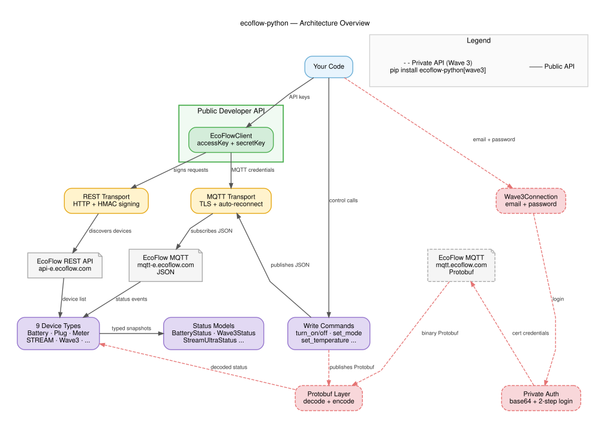

# Getting Started



`ecoflow-python` is a typed async Python SDK for controlling and monitoring EcoFlow energy
devices. This guide covers installation, authentication, a working quick-start for each API path,
a full reference table of supported devices, error handling, and live event streaming.

> **Contributors / AI agents:** see [`AGENTS.md`](../../AGENTS.md) for the authoritative guide
> to navigating this codebase.

---

## Installation

```bash
# Public Developer API — covers most devices
pip install ecoflow-python

# Wave 3 portable AC support — requires Protobuf
pip install "ecoflow-python[wave3]"
```

**Minimum Python version**: 3.11

**Core dependencies**: `httpx`, `aiomqtt`  
**Wave 3 extra**: adds `protobuf >= 4.0`

---

## Getting Your API Keys

### Public Developer API (most devices)

1. Visit the [EcoFlow Developer Portal](https://developer.ecoflow.com/) and create a free account.
2. Under **Access Management → API Keys**, generate an **Access Key** and **Secret Key**.
3. Your keys are tied to the account that owns the devices. Devices from other accounts are not
   visible.
4. Note your region: **EU** (`api-e.ecoflow.com`) or **US** (`api.ecoflow.com`).

```python
from ecoflow import EcoFlowClient

client = EcoFlowClient(
    access_key="YOUR_ACCESS_KEY",
    secret_key="YOUR_SECRET_KEY",
    region="EU",   # or "US"
)
```

### Private API (Wave 3 only)

The Wave 3 portable AC returns error 1006 from the public Developer API. Use your **EcoFlow app
email and password** instead. No developer portal registration is required.

```python
from ecoflow.private import Wave3Connection

conn = Wave3Connection(
    email="you@example.com",
    password="your_app_password",
    device_sns=["AC71XXXXXXXXXXXX"],   # your Wave 3 serial number
)
```

---

## Quick Start — Public API

```python
import asyncio
from ecoflow import EcoFlowClient

async def main() -> None:
    async with EcoFlowClient(
        access_key="YOUR_ACCESS_KEY",
        secret_key="YOUR_SECRET_KEY",
        region="EU",
    ) as client:
        # --- Read status from discovered batteries ---
        for battery in client.batteries:
            status = await battery.refresh()
            print(f"{battery.sn}: {status.soc:.1f}% SOC, "
                  f"{status.total_input_watts:.0f}W in / "
                  f"{status.total_output_watts:.0f}W out")

        # --- Read status from smart plugs ---
        for plug in client.plugs:
            data = await plug.refresh()
            print(f"{plug.sn}: {'ON' if data.is_on else 'OFF'}, "
                  f"{data.power_watts:.1f}W, {data.voltage:.1f}V")

        # --- Read STREAM Ultra status ---
        for stream in client.stream_units:
            status = await stream.refresh()
            print(f"{stream.sn}: {status.batt_soc:.1f}% battery, "
                  f"grid {status.grid_power_watts:.0f}W, "
                  f"PV {status.pv_power_watts:.0f}W, "
                  f"load {status.load_power_watts:.0f}W")

        # --- Send commands ---
        if client.batteries:
            bat = client.batteries[0]
            await bat.set_charge_limit(soc_pct=90)
            await bat.set_ac_output(enabled=True)

        if client.plugs:
            await client.plugs[0].turn_on()

        if client.stream_units:
            stream = client.stream_units[0]
            await stream.set_charge_limit(soc_pct=95)
            await stream.set_discharge_limit(soc_pct=10)
            await stream.set_relay2(on=True)    # AC outlet 1

asyncio.run(main())
```

### What `EcoFlowClient` does on `connect()`

1. Fetches the authenticated device list via REST (`/iot-open/sign/device/list`)
2. Routes each device to a typed class by `productName` (or SN prefix as fallback)
3. Connects to the EcoFlow MQTT broker with a generated `ANDROID_{UUID}_{account}` client ID
4. Subscribes each typed device to its MQTT topic and registers message callbacks

All typed device collections (`client.batteries`, `client.plugs`, `client.meters`,
`client.wave3_units`, `client.inverters`, `client.stream_units`) are populated after `connect()`.
Unrecognised devices appear in `client.unknown_devices` as `DiscoveredDevice` instances.

---

## Quick Start — Wave 3 Private API

The Wave 3 uses a separate code path: email/password auth → Protobuf MQTT. Install the Wave 3
extra first:

```bash
pip install "ecoflow-python[wave3]"
```

```python
import asyncio
from ecoflow.private import Wave3Connection, Wave3Mode

WAVE3_SN = "AC71XXXXXXXXXXXX"

async def main() -> None:
    async with Wave3Connection(
        email="you@example.com",
        password="your_app_password",
        device_sns=[WAVE3_SN],
    ) as conn:
        device = conn.devices[WAVE3_SN]

        # Wait for the first MQTT state dump (device is silent until triggered)
        await asyncio.sleep(3)

        # --- Read status ---
        status = await device.refresh()
        print(f"Wave 3 — on={status.is_on}, mode={status.mode}, "
              f"ambient={status.ambient_temp:.1f}°C, "
              f"target={status.target_temp:.1f}°C, "
              f"battery={status.battery_soc:.1f}%")

        # --- Write commands ---
        await conn.turn_on(WAVE3_SN)              # power on in cooling mode
        await conn.set_temperature(WAVE3_SN, 22.0)  # 16.0–30.0 °C
        await conn.set_mode(WAVE3_SN, Wave3Mode.COOLING)
        await conn.set_fan_speed(WAVE3_SN, 2)     # 1=low, 2=medium, 3=high, 4=high+, 5=max
        await conn.set_humidity_target(WAVE3_SN, 50.0)   # dehumidify mode: 40.0–80.0%

        # Charge / discharge limits (for the built-in battery)
        await conn.set_charge_limit(WAVE3_SN, soc_pct=90)
        await conn.set_discharge_limit(WAVE3_SN, soc_pct=10)

        await conn.turn_off(WAVE3_SN)

asyncio.run(main())
```

### How `Wave3Connection` works

1. Calls `ecoflow.private.auth.login(email, password)` — POSTs with base64-encoded password,
   then GETs MQTT credentials from `/iot-auth/app/certification`.
2. Creates one `Wave3Device(rest=None)` per SN.
3. Starts a background asyncio task that connects to `mqtt.ecoflow.com:8883` (TLS) and
   subscribes to `/app/device/property/{sn}` at QoS 1.
4. Publishes a GET trigger to `/app/{userId}/{sn}/thing/property/get` so the device sends an
   immediate full-state dump instead of waiting for its next heartbeat.
5. Decodes incoming Protobuf messages (with optional XOR decryption) and calls
   `Wave3Device._handle_message()` to update `device.status`.
6. Reconnects automatically with exponential backoff (1 s → 2 s → … → 300 s cap) on any
   MQTT failure.

---

## Supported Devices

| Device model | Class | SN prefix | Status type | Read fields (selected) | Write commands |
|---|---|---|---|---|---|
| DELTA Pro, DELTA Pro 3, DELTA 2, DELTA 2 Max, RIVER PRO, RIVER 2, RIVER 2 Max, RIVER 2 Pro | `BatteryDevice` | varies | `BatteryStatus` | `soc`, `total_input_watts`, `total_output_watts`, `ac_input_watts`, `ac_output_watts`, `dc_output_watts`, `mppt_input_watts`, `remaining_charge_time_min`, `remaining_discharge_time_min`, `inverter_temp`, `bms_modules`, `solar_input` | `set_ac_output(enabled)`, `set_dc_output(enabled)`, `set_charge_limit(soc_pct)`, `set_discharge_limit(soc_pct)`, `set_ac_charging_power(watts)` |
| Smart Plug | `SmartPlugDevice` | `HW52` | `SmartPlugData` | `is_on`, `power_watts`, `voltage`, `current`, `daily_energy_wh`, `on_time_seconds`, `temp`, `brightness` | `turn_on()`, `turn_off()`, `toggle()`, `set_brightness(brightness)`, `set_max_watts(max_watts)` |
| Smart Meter | `SmartMeterDevice` | `BK21` | `SmartMeterData` | `grid_power_watts`, `grid_status`, `power_factor`, `voltage_l1/l2/l3`, `power_l1/l2/l3`, `current_l1/l2/l3`, `total_active_energy_wh`, `today_active_energy_wh`, `total_exported_energy_wh` | None (read-only) |
| PowerStream | `MicroInverterDevice` | — | `SmartMeterData` | same as Smart Meter (temporary model) | `set_feed_in_power(watts)` (0–800 W) |
| STREAM Ultra | `StreamUltraDevice` | `BK11` | `StreamUltraStatus` | `batt_soc`, `soc_precise`, `grid_power_watts`, `load_power_watts`, `pv_power_watts`, `battery_power_watts`, `relay2_on`, `relay3_on`, `max_charge_soc`, `min_discharge_soc`, `remaining_cap_wh`, `full_cap_wh`, `temp`, `cycles` | `set_charge_limit(soc_pct)`, `set_discharge_limit(soc_pct)`, `set_relay2(on)`, `set_relay3(on)`, `set_grid_export(enabled)`, `set_backup_reserve(soc_pct)`, `set_self_powered_mode(enabled)`, `set_ai_schedule_mode(enabled)` |
| STREAM AC Pro | `StreamAcProDevice` | `BK31` | `StreamUltraStatus` | same as STREAM Ultra | same as STREAM Ultra |
| Wave 3 (public API) | `Wave3Device` | `AC71` | `Wave3Status` | device appears in `client.wave3_units` but status fields are at defaults — public API returns error 1006 for Wave 3 quota | None via public API |
| Wave 3 (private API) | `Wave3Connection` | `AC71` | `Wave3Status` | `is_on`, `mode`, `ambient_temp`, `target_temp`, `supply_air_temp`, `condenser_temp`, `outdoor_temp`, `fan_level`, `airflow_speed`, `ambient_humidity`, `battery_soc`, `system_soc`, `input_power_watts`, `output_power_watts`, `water_level`, `discharge_time_min`, `charge_time_min` | `turn_on(sn)`, `turn_off(sn)`, `set_mode(sn, mode)`, `set_temperature(sn, temp_c)`, `set_fan_speed(sn, level)`, `set_humidity_target(sn, pct)`, `set_charge_limit(sn, soc_pct)`, `set_discharge_limit(sn, soc_pct)` |
| Smart Home Panel 2 | `SmartHomePanelDevice` | — | `dict` (raw) | raw quota fields — no typed model yet | None |

> **Note:** Wave 3 mode constants — `Wave3Mode.COOLING`, `Wave3Mode.HEATING`, `Wave3Mode.VENTING`
> (fan only), `Wave3Mode.DEHUMIDIFYING`, `Wave3Mode.THERMOSTATIC`. Import from
> `ecoflow.private` or `ecoflow.models`.

> **Note:** `battery_soc` on `Wave3Status` is the internal BMS battery SOC. `system_soc` is the
> CMS system-level aggregate. `fan_level` (1–5 read-only) is not the same scale as
> `set_fan_speed()` (1–5 write), which maps 1→20, 2→40, 3→60, 4→80, 5→100 in the wire
> protocol.

---

## Error Handling

All library exceptions inherit from `EcoFlowError`:

```python
from ecoflow import (
    EcoFlowError,
    EcoFlowAuthError,
    EcoFlowConnectionError,
    EcoFlowDeviceNotFoundError,
    EcoFlowTimeoutError,
    EcoFlowDeviceOfflineError,
)
from ecoflow.exceptions import EcoFlowCommandError
```

| Exception | When it occurs |
|---|---|
| `EcoFlowError` | Base class — catch-all for any library error |
| `EcoFlowAuthError` | Bad `access_key`/`secret_key`, bad email/password, or API returns a non-zero auth code |
| `EcoFlowConnectionError` | Network failure, MQTT not connected when a command is issued, Wave 3 MQTT not yet ready |
| `EcoFlowDeviceNotFoundError` | Device SN not found in the account; carries `.sn` attribute |
| `EcoFlowTimeoutError` | REST request or Wave 3 MQTT connect timed out |
| `EcoFlowDeviceOfflineError` | Action attempted on a device that is offline; carries `.sn` attribute |
| `EcoFlowCommandError` | Device rejected a write command |

### Example error handling

```python
from ecoflow import (
    EcoFlowAuthError,
    EcoFlowConnectionError,
    EcoFlowDeviceOfflineError,
    EcoFlowError,
)

async def safe_read(battery):
    try:
        status = await battery.refresh()
        return status
    except EcoFlowDeviceOfflineError as exc:
        print(f"Device {exc.sn} is offline — skipping")
    except EcoFlowAuthError:
        print("Authentication failed — check your API keys")
        raise
    except EcoFlowConnectionError as exc:
        print(f"Network error: {exc}")
    except EcoFlowError as exc:
        print(f"Unexpected EcoFlow error: {exc}")
```

---

## Event Streaming

All typed devices expose `device.events()`, an async generator that yields the typed status
dataclass on each incoming MQTT update.

```python
import asyncio
from ecoflow import EcoFlowClient

async def stream_battery_events() -> None:
    async with EcoFlowClient(
        access_key="YOUR_ACCESS_KEY",
        secret_key="YOUR_SECRET_KEY",
        region="EU",
    ) as client:
        if not client.batteries:
            print("No batteries found")
            return

        battery = client.batteries[0]
        print(f"Streaming events for {battery.sn} …")

        async for status in battery.events():
            print(
                f"[{status.updated_at}] SOC={status.soc:.1f}% "
                f"in={status.total_input_watts:.0f}W "
                f"out={status.total_output_watts:.0f}W"
            )

asyncio.run(stream_battery_events())
```

### Using `on_update` callbacks

For synchronous callbacks (e.g. in frameworks that manage their own event loop):

```python
from ecoflow.models import BatteryStatus

def on_battery_update(status: BatteryStatus) -> None:
    print(f"Battery update: {status.soc:.1f}% SOC")

battery.on_update(on_battery_update)
```

Multiple callbacks can be registered; they are called in registration order. Exceptions inside a
callback are logged and suppressed — they do not interrupt other callbacks or the MQTT loop.

### Wave 3 streaming (private API)

```python
async def stream_wave3() -> None:
    async with Wave3Connection(
        email="you@example.com",
        password="your_app_password",
        device_sns=[WAVE3_SN],
    ) as conn:
        device = conn.devices[WAVE3_SN]

        async for status in device.events():
            print(
                f"Wave 3: {'ON' if status.is_on else 'OFF'}, "
                f"mode={status.mode}, "
                f"ambient={status.ambient_temp:.1f}°C, "
                f"battery={status.battery_soc:.1f}%"
            )
```

---

## Architecture Reference


For the full codebase map, test commands, design quirks, and known incomplete areas, see
[`AGENTS.md`](../../AGENTS.md).
