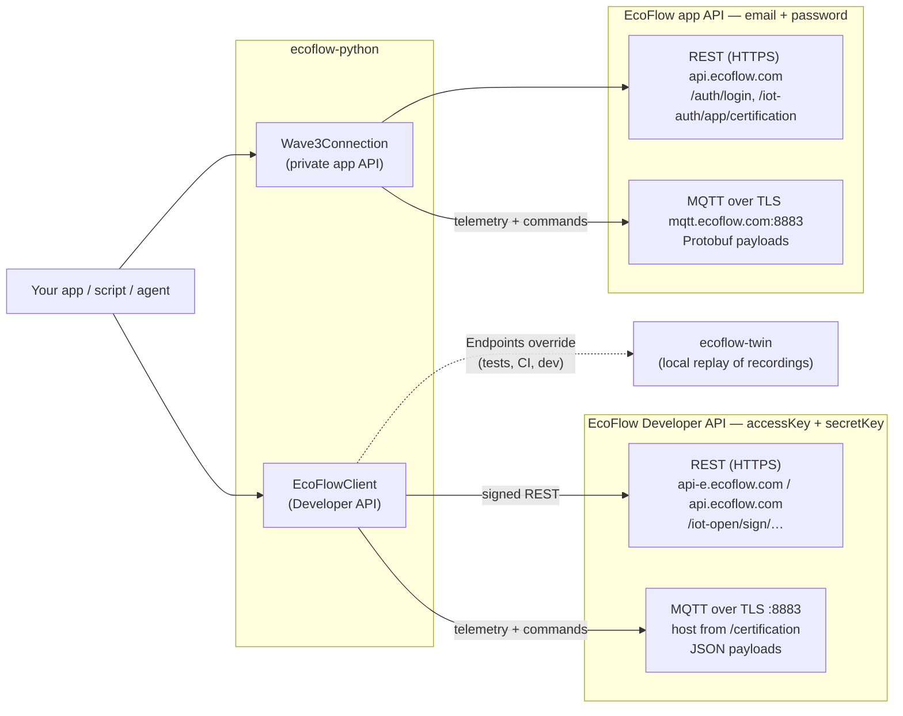
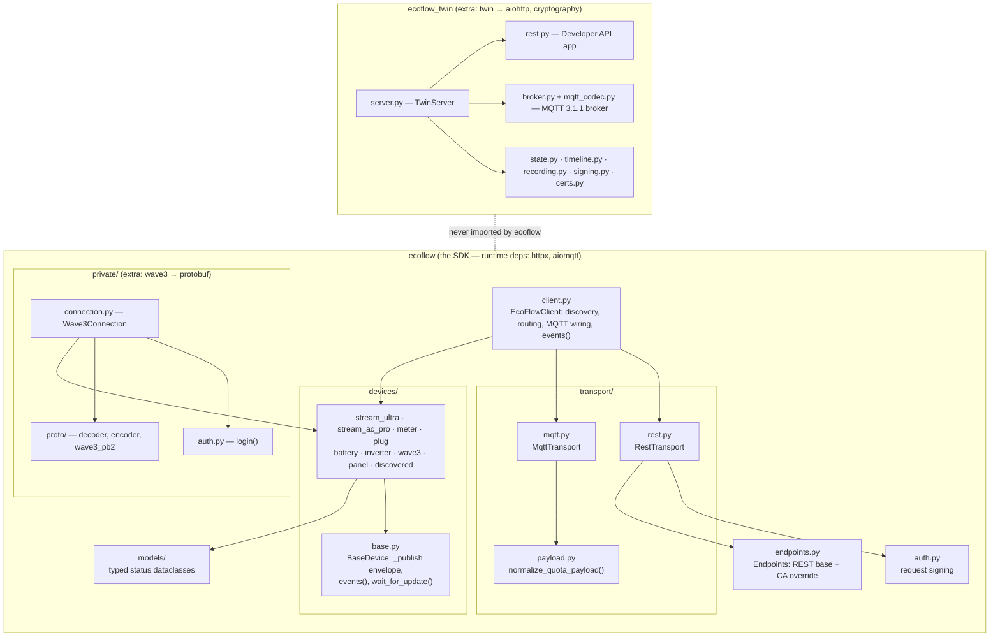
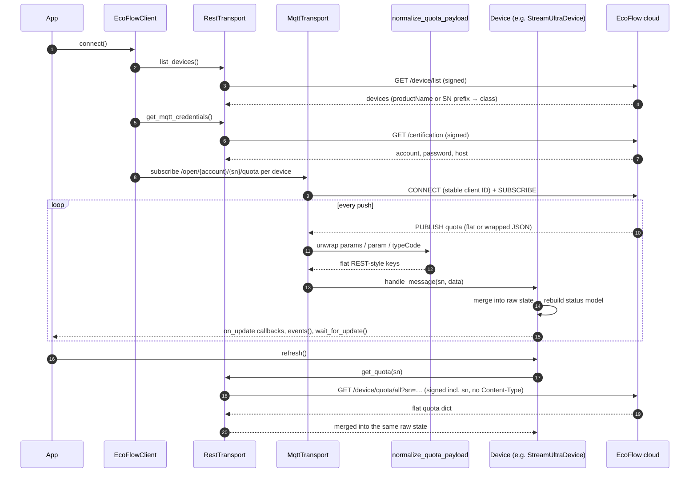
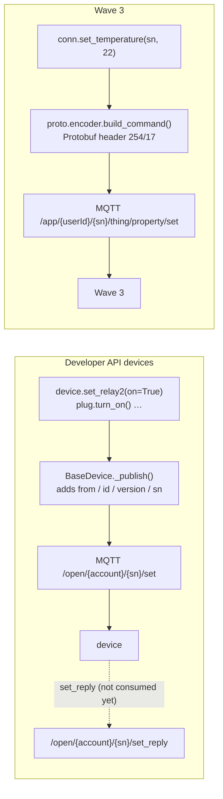
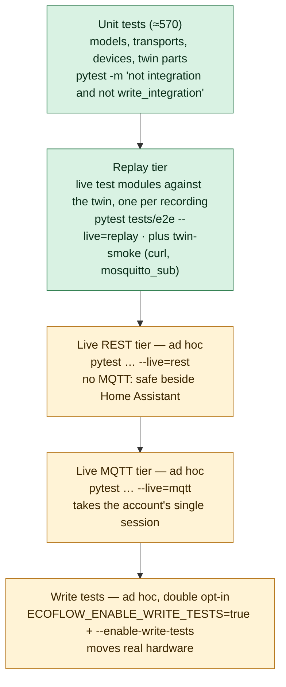
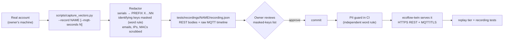

# Architecture

How `ecoflow-python` is put together, how data moves through it, and how it is
tested. The diagrams are Mermaid, so they render on GitHub and diff as text.
Why each piece is the way it is lives in [decisions/](decisions/README.md);
how it got here is in [history.md](history.md).

- [System context](#system-context)
- [Packages and modules](#packages-and-modules)
- [Reading device state](#reading-device-state)
- [Sending commands](#sending-commands)
- [Testing architecture](#testing-architecture)
- [Recording pipeline](#recording-pipeline)

## System context

EcoFlow exposes **two unrelated APIs**, and the SDK has one entry point per API
([ADR 0001](decisions/0001-two-separate-api-paths.md)). They share no
credentials, broker, topics or wire format.

| | Developer API (`EcoFlowClient`) | App API (`Wave3Connection`) |
|---|---|---|
| Devices | STREAM Ultra / AC Pro, Smart Meter, Smart Plug, DELTA/RIVER, PowerStream | Wave 3 (the Developer API answers `1006` for it) |
| Auth | HMAC-SHA256 signed REST; MQTT user/password from `/certification` | Login (base64 password) → bearer token → `/iot-auth/app/certification` |
| MQTT client ID | `ecoflow-sdk-<hash(account)>` (stable) | `ANDROID_<hash(userId)>_<userId>` (stable, shape required by the broker) |
| Telemetry topic | `/open/{account}/{sn}/quota` | `/app/device/property/{sn}` |
| Command topic | `/open/{account}/{sn}/set` | `/app/{userId}/{sn}/thing/property/set` |
| Wire format | JSON (flat or wrapped per family) | Protobuf, XOR-obfuscated |

Both brokers allow **one session per account** and about **10 unique client IDs
per account per day**; both refuse with MQTT code 135
([ADR 0002](decisions/0002-stable-mqtt-client-ids.md),
[ADR 0003](decisions/0003-fail-fast-on-first-connect-135.md)).

## Packages and modules

## Reading device state

Every typed device keeps one accumulated raw dict and rebuilds its status model
from it. REST (`refresh()`) and MQTT pushes feed the same parser, because MQTT
payloads are first converted to the REST key layout
([ADR 0005](decisions/0005-normalize-mqtt-to-rest-layout.md)).

`EcoFlowClient(enable_mqtt=False)` stops after discovery: REST reads only, so it
never takes the account's single MQTT session.

## Sending commands

STREAM commands also need `cmdId 17 / cmdFunc 254 / dirDest / dirSrc / dest /
needAck`; without them the device ignores the command
([ADR 0006](decisions/0006-command-envelope.md), AGENTS.md Quirk 13).
Command acknowledgements (`set_reply`, Wave 3 `cmd_id 18`) are not surfaced yet —
see [validation-status.md](validation-status.md).

## Testing architecture

Tests are layered by how much of the real world they touch. Only the first two
layers run in CI; nothing in CI talks to EcoFlow
([ADR 0008](decisions/0008-live-tests-ad-hoc-never-ci.md)).

Green layers run in CI on every PR; amber layers run only on a trusted machine
with the owner's credentials in the gitignored `tests/.env`
([live-testing.md](api/live-testing.md)).

## Recording pipeline

Real device behaviour enters CI only as **redacted recordings**
([ADR 0009](decisions/0009-record-replay-as-ci-source-of-truth.md),
[ADR 0012](decisions/0012-pii-policy.md)).

The twin is a behavioural clone at the network boundary: it verifies
signatures independently of the SDK, enforces the one-session and client-ID
rules, and plays the recorded MQTT timeline in a loop
([ADR 0010](decisions/0010-service-digital-twin.md),
[digital-twin.md](api/digital-twin.md)).

## Older diagrams

`docs/diagrams/*.dot|svg|png` are the v0.3.0 (June 2026) diagrams. They predate
the twin, record/replay and the tiered tests, and are kept as a historical
snapshot (see [diagrams/README.md](diagrams/README.md)).
