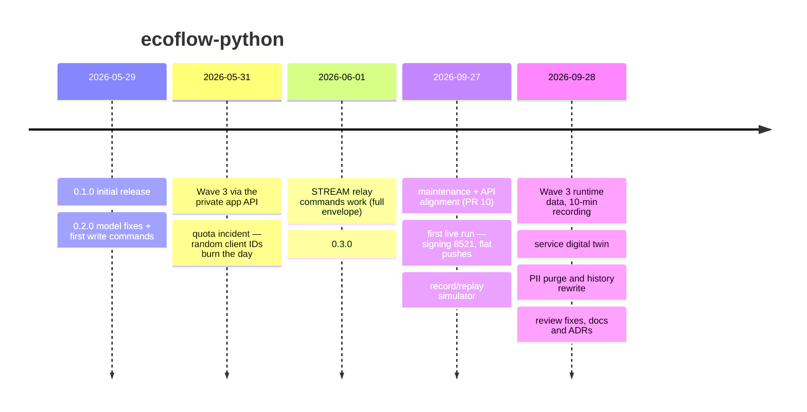

# How we got here

A chronology of `ecoflow-python`: what was learned, when, and what it cost. The
*why* of each lasting decision is in [decisions/](decisions/README.md). The
protocol facts themselves are in [AGENTS.md](../AGENTS.md) (the numbered
quirks). What has and hasn't been proven on hardware is in
[validation-status.md](validation-status.md).

References are PR numbers and commit titles. Commit SHAs changed when history
was rewritten on 2026-09-28 ([ADR 0012](decisions/0012-pii-policy.md)), so SHAs
quoted in old commit messages no longer resolve.

## Who worked on it

The owner has the hardware: a STREAM Ultra with four STREAM AC Pro units, a
Smart Meter, a Smart Plug and a Wave 3. They also hold the only credentials.
Most code was written with AI coding assistants, in two kinds of session:

- **Cloud sessions** can't reach EcoFlow. They write code, unit tests, the twin
  and docs.
- **Local sessions** run on the owner's machine with `tests/.env`. They run the
  live tiers and capture recordings, and ask first before taking the MQTT
  session.

Moving work between the two is deliberate: [ADR 0008](decisions/0008-live-tests-ad-hoc-never-ci.md).

## Timeline

### May 2026: first releases (0.1.0, 0.2.0)

- **"feat: initial release — EcoFlow Python SDK v0.1.0"**:
  - `EcoFlowClient` for the Developer API, with REST discovery and MQTT;
  - typed models for STREAM, Smart Meter, Smart Plug, batteries and PowerStream.
- **"fix: resolve all pyright strict-mode errors (CI green)"** (PR #1).
- **"feat: model fixes and write commands (validated against real hardware)"**, released as 0.2.0:
  - STREAM capacity is in mAh, not Wh.
  - EcoFlow labels the meter's *exported* energy as "reactive".
  - The grid power sign convention is documented.
  - The first write commands went in (plug, STREAM). As that commit says, they were *not* exercised on hardware.

### 30 May – 1 June 2026: Wave 3, the quota incident, relays (0.3.0)

- **30 May, "feat: Wave 3 discovery fix + read-only E2E integration tests".** The Developer API answers `1006` for the Wave 3 (SN prefix `AC71`).
- **31 May, "feat: Wave 3 private API support — read + write commands validated against real hardware".** The only way to reach the Wave 3 is the mobile app's own API:
  - email + base64 password login, then a two-step certification;
  - Protobuf over MQTT with XOR obfuscation;
  - the device stays silent until it receives a GET trigger;
  - `turn_on()` must also set the mode;
  - temperatures are native °C.

  These are AGENTS.md Quirks 6–12 and [ADR 0001](decisions/0001-two-separate-api-paths.md).
- **31 May, the quota incident.** Each connection attempt used a fresh `uuid4()` client ID. About 20 attempts in one debugging session used up the account's roughly 10 IDs for the day. Every connect then returned `135`, which looked like bad credentials. The same code also covers "another session already holds the account", for example Home Assistant. The fixes:
  - stable, hash-derived client IDs;
  - fail fast on the first 135;
  - a message that names both causes.

  See Quirks 1–5 and ADRs [0002](decisions/0002-stable-mqtt-client-ids.md) and [0003](decisions/0003-fail-fast-on-first-connect-135.md).
- **1 June, "feat: STREAM relay commands — validated against real BK11/BK31 hardware"** (PR #6). STREAM ignores commands silently unless they carry the full envelope (Quirk 13, [ADR 0006](decisions/0006-command-envelope.md)). `set_relay2` toggled an outlet on a real STREAM Ultra, which was released as **0.3.0**.

  The same PR also replaced the Wave 3's `ANDROID_…` client ID with a stable `ecoflow-private-<hash>`. It was stable, but the app broker refuses that shape, so **every Wave 3 connection failed** from 0.3.0 on. Nobody noticed for four months.

### 27 September 2026: maintenance, then the first live run in months

- **PR #10, "Maintenance, public API alignment, working event streams, and ad hoc live-test tiers".** This was a cloud session with no live access. Changes:
  - request params are signed as the spec requires;
  - MQTT pushes are normalised to the REST layout;
  - the envelope is added to every command;
  - `events()` and `wait_for_update()` work, plus REST-only mode;
  - live tests are tiered, and the CI live job is removed ([ADR 0008](decisions/0008-live-tests-ad-hoc-never-ci.md)).

  **It was merged before any live run.**
- **The live run happened in a local session and became PR #11** ("live-validated fixes + record/replay simulator for CI"):
  - **Signing:** every param-signed read failed with `8521`. The API verifies a GET *without* its params when the request carries `Content-Type: application/json`, so GETs no longer send it ([ADR 0004](decisions/0004-rest-request-signing.md)).
  - **Push shapes:** STREAM and meter pushes turned out to be **flat**, not wrapped as the docs said. The plug uses a `params` envelope. The normaliser was harmless for flat pushes; the docs were wrong ([ADR 0005](decisions/0005-normalize-mqtt-to-rest-layout.md), Quirk 14).
  - **STREAM batteries:** each battery pack reports only in its own MQTT push, and `refresh()` must merge rather than replace. Otherwise a cascade-slave AC Pro showed 0 %.
  - **`chgDsgState`:** 2 means **charging**, seen during a 5.2 kW grid charge. The model had it backwards.
  - **Windows:** the Proactor event loop can't run aiomqtt, so connect now fails fast.
  - **Wave 3 connection:** the broken client ID was traced back through the history, and the `ANDROID_` shape was restored with a hash-derived, stable suffix. `Wave3Connection` now fails fast on 135 (#19).
  - **Record/replay:** `capture_vectors.py --record`, a redactor, the `--live=replay` tier in CI, and the first recording, `live-20260927` ([ADR 0009](decisions/0009-record-replay-as-ci-source-of-truth.md)).
  - **Tracking:** beads issue tracking was initialised (`bd init`) next to the GitHub issues. The epics #12 (validated readings) and #21 (digital twin) were opened.

### 28 September 2026: Wave 3 data, the twin, a PII purge

- **PR #26, Wave 3 reliable reading.**
  - The decoder reads the runtime message (`cmd_id 22`): AC input voltage and battery V/A.
  - Placeholder "0 % / off" statuses are gone.
  - A 10-minute recording, `live-20260928` (1131 pushes), covers a grid charge.
  - The Wave 3's full state dump arrives on the device's own 120 s schedule (Quirk 12b).
- **PR #28, service digital twin (Twin 1a)** ([ADR 0010](decisions/0010-service-digital-twin.md), [digital-twin.md](api/digital-twin.md)):
  - HTTPS REST plus its own MQTT/TLS broker, reproducing EcoFlow's refusals;
  - `Endpoints` override ([ADR 0011](decisions/0011-endpoint-override.md));
  - the replay tier now runs over real sockets;
  - a `curl` + `mosquitto_sub` smoke job.

  Its first catch: the Smart Plug pushes a transient `volt: 0` about 2 s before every real reading (Quirk 15).
- **PR #29 and PR #30, PII.** A review of the new recording found identifiers the redactor had missed:
  - LAN IPs stored as integers;
  - serial tails, LAN key fingerprints, mesh IDs and the timezone;
  - elsewhere, a fragment of the MQTT password in `mqtt-guide.md`, and real serials in old docs.

  The redactor and an independent CI guard now match identifying words anywhere in a key ([ADR 0012](decisions/0012-pii-policy.md)).
- **History rewrite.** `git filter-repo` removed every leaked value from every commit, tag and commit message, and the owner force-pushed the result. Verified: 0 matches on `main` and the three tags. Work that git can't do is listed in ADR 0012: GitHub PR refs, PyPI 0.1.0/0.2.0, key rotation.
- **PR #31, review fixes.**
  - The endpoint override is logged and must be https with a host.
  - The twin key is owner-only.
  - Installing without the twin extra now gives a clear hint.
  - Commit SHAs left dangling by the rewrite now cite commit titles.

  GitHub Copilot's review of it led to host validation, split warnings and strict key permissions.
- **This documentation pass:** the architecture diagrams, these ADRs, this history and the validation status.

## Lessons

1. **Spec-correct is not live-correct.** PR #10 fixed signing "to spec" and broke every read. A header nobody thought about decided the outcome. Validate on hardware, or on a recording that exercises the change, before calling it done ([ADR 0013](decisions/0013-history-and-evidence.md)).
2. **Every attempt costs quota.** On EcoFlow's MQTT, a retry loop with fresh IDs can lock you out for the day. Make IDs stable and fail fast.
3. **Keep the working shape as well as the property you want.** The Wave 3 client ID was made stable and lost the shape the broker requires. Check how behaviour was validated before "fixing" it.
4. **Docs drift toward assumptions.** "Pushes are wrapped in `params`" was written from a reference and never checked, and two fields were documented backwards. Recordings now keep the docs honest.
5. **A replay against real sockets finds real bugs.** The in-process fake never caught the plug's `volt: 0`; the twin did, within a day.
6. **Redaction needs an independent check.** The capture redactor and the CI guard now use separately written rules, and a test makes them agree. A suffix-only rule had leaked for a day into a public repo.
7. **Investigation scripts are evidence.** A clean-up proposed deleting the `wave3_*` probes. They were restored, because they record how the protocol was found. They are now flagged as quota-burning instead.
8. **The public-repo cost of a leak is outside git too.** GitHub PR refs, published wheels and live credentials each need their own remediation.

## Open threads

- **#22, Twin 1b:** Wave 3 / app-API playback in the twin.
- **#23:** recorder CLI.
- **#24:** Docker and DNS.
- **#25:** mobile-app spike.
- **#18:** Wave 3 readings to check against the app.
- **#20:** unmapped fields.
- **#27:** community protocol reference. This page, the ADRs and [architecture.md](architecture.md) cover part of it.
- **Write commands and devices without hardware:** see [validation-status.md](validation-status.md).
